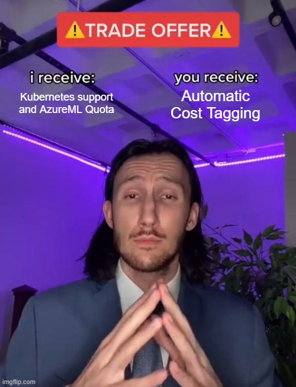

# Mansa - a FinOps aware linter

{fig-align="center"}

FinOps is an operational framework and cultural practice that enhances the business value derived from cloud technology. It promotes data-driven decision-making in a timely manner and fosters financial responsibility. It gets achieved through collaboration among engineering, finance, and business teams.

FinOps is a discipline that combines financial management principles with cloud engineering and operations to provide organizations with a better understanding of their cloud spending. It also helps them make informed decisions on how to allocate and manage their cloud costs. The goal of FinOps isn't to save money, but to maximize revenue or business value through the cloud. It helps to enable organizations to control cloud spending while maintaining the level of performance, reliability, and security needed to support their business operations.

All of the cloud service providers also allow for the use of tags which can be applied as metadata to most individual resources, and which then appear in the detailed billing reports providing cost and usage data when turned on by the user. Tagging is an essential pre-requirement for FinOps implementation.

Mansa is a lintin tool used internally at B2-Impact to enforce cost-tagging at build time as part of our standard CI-CD pipelines for Azure Machine Learning Resources.

# Why Mansa?

Usually IOps teams deploy their infrastructure using terraform/bicep/cdk languages. However in most of the cases the IOps teams are only in charge of deploying the infrastructure "container" that an application will use. In the case of Machine Learning this situation is even more common as the recursive an experimental nature of AI applications makes quite common the fact that we do not know which deployment configuration will be best during the development phase.

Besides a lot of MLOps processes as creation of ML pipelines, compute clusters, job launching, inference endpoints etc... are invoked via python SDKs and not terraform code.

Because of that we decided to create Mansa. Mansa scans all your python code in search of classes that accept the tags arguments, currently these classes are configurable with a config.toml file as we have not been able to come up with a better method that is as simple as this.

Mansa also looks that the tags contains a certain key-value pairs with allowed values. Currently this is hardcoded in the code but we plan to make this configurable via a section in the config.toml file.

## Why this name?

Mansa Musa was the 9th Mansa of the Mali Empire, he was one of the richest people in history, according to some research \[1\] he was so rich that he was generating inflation wherever he went. His wealth was not measurable and therefore neither his spending. We took inspiration of his story for the naming of this package as we believe is important to keep track of cost but also because [cloud cost inflation is a real phenomena](https://www.techtarget.com/searchcio/news/366570542/Cloud-costs-continue-to-rise-in-2024#:~:text=The%20cloud%20inflation%20trend%20looks,pattern%20of%20rising%20cloud%20costs.).

# Usage

``` bash
mansa /path/to/your/directory
```

# Build Instructions

1.  Install poetry via the [oficial installer](https://python-poetry.org/docs/#installing-with-the-official-installer):

    ``` bash
    curl -sSL https://install.python-poetry.org | python3 -
    ```

2.  Clone this repository with:

    ``` bash
    git clone https://b2holdingglobal@dev.azure.com/b2holdingglobal/Data%20and%20Analytics%20-%20Internal/_git/dna-mansa
    ```

    Or if you have an [Azure DevOps ssh key](https://learn.microsoft.com/en-us/azure/devops/repos/git/use-ssh-keys-to-authenticate?view=azure-devops) in your computer:

    ``` bash
    git@ssh.dev.azure.com:v3/b2holdingglobal/Data%20and%20Analytics%20-%20Internal/dna-mansa
    ```

3.  Ensure poetry is using the correct virtual environment. You can activate the environment manually with:

    ``` bash
    poetry shell
    ```

4.  Install dependencies and build the package:

    ``` bash
    poetry install
    ```

5.  Build the package:

    ``` bash
    poetry build
    ```

# Development guidelines

As usual, we stick to [TBD](https://trunkbaseddevelopment.com/), Create your own branch according to the following guidelines:

-   {type_of_branch}/{namefirstlettersurnamefirstlettersurnamesecondletter}/{change_name}

-   Being type of branch:

    -   feat (of feature).

    -   bugfix/fix (to fix a bug).

    -   enh/improvement (for enhancement, usually runtime performance).

### Introducing dependencies.

Please install dependencies via:

``` bash
poetry add {dependency-name}=={version}
```

When doing that your pyproject.toml file will be automatically updated as well as the lock files.

\[1\] Goodwin, A. J. H. (1957). The Medieval Empire of Ghana. *The South African Archaeological Bulletin*, *12*(47), 108–112. https://doi.org/10.2307/3886971